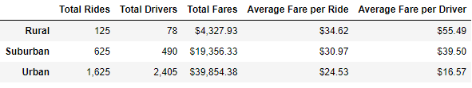
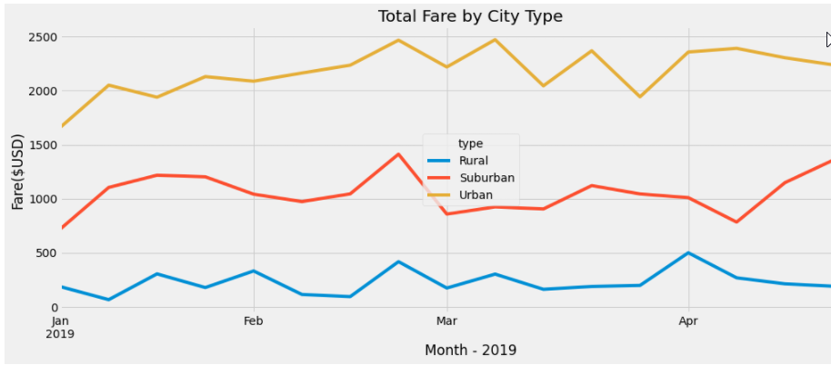

# PyBer Ride-Sharing Data Analysis

## Overview of the analysis: 
The purpose of this analysis was provide a summary of PyBer's ride-sharing data by city type utilizing a Pandas Dataframe. We also utilized matplotlib to provide a data visualization in the form of a multiple-line chart to illustrate the total fares for each city type. The goal of this analysis was to help PyBer leadership make business decisions that could improve access to ride-sharing services and accessibility for underserved neighborhoods. 

## Results: 

### Summary DataFrame: 

The first part of our PyBer Analysis involved merging two data sets, ride_data and city_data, based on the shared "city" column. We then created multiple Pandas series for the metrics outlined below. We then utilized these Pandas series to create a new **PyBer Summary DataFrame**:

**Highlights of the differences in ride-sharing data amongst the different city types include:** 

- **Total Rides:**
  - There are 13 times more rides in urban areas versus rural areas. There are 2.5 times more rides in urban areas vs. suburban areas. This makes sense from a common sense perspective given the population density in urban versus rural cities; however, it is likely that this dramatic difference may lead to disparities in access to Pyber's ride-sharing services.   
- **Total Drivers:**
  - There is a dramatic difference in the number of drivers in urban areas versus rural areas. There are nearly 31 times more drivers in urban versus rural areas. While this is expected to a certain extent, this large disparity in the number of drivers leads to significantly higher demand and higher prices for rural customers. 
- **Total Fares:**
  - Despite there being 31 times more drivers in urban areas than rural areas, total fares in urban areas are only 9 times higher than rural fares. This indicates that higher costs are being passed on to rural customers due to markedly reduced number of drivers in rural cities. 
- **Average Fare per Ride:**
  - As a result of the markedly low number of drivers in rural areas, the average fare per ride is highest in rural areas.
  - Rural customers pay nearly 30 percent more per ride than their urban counterparts. 
  - Suburban customers pay about 21 percent more than urban customers.    
- **Average Fare per Driver:**
  - Given the scarcity of drivers in rural areas, rural drivers have the highest average fare per driver which is 3 times the average fare of urban drivers. Suburban drivers' average fare is 2 times higher than their urban counterparts. Urban drivers make the least of the drivers in any city type. Because of this, it may be difficult for these drivers to earn enough money to support their families.  
- **Total Fare by City Type:**
  - See image below.
  - The multi-line chart highlights that the highest peak for all city types occurs in the last week of February. The chart also illustrates that their is a significant drop in total fares between the last week in April and early May. 

## Summary: 

Based on this analysis, we would like to offer **three business recommendations** to our CEO and board to address disparities between the city types: 
- **Recommendation 1:** Conduct a **driver recruitment campaign** in rural cities in order to lower the average fare per ride for rural customers. The high price of a single ride may limit accessibility to ride-sharing services by residents in these areas. 
- **Recommendation 2:** In order to further investigate disparities in PyBer ride-sharing services among various city types, it may be helpful for PyBer to collect data regarding the **average mileage per ride**. It is reasonable to assume that urban riders may be travelling shorter distances due to the compact nature of a city versus a more spread out rural area.An analysis of this additional data may prove useful in comparing urban versus rural average fares per ride.   
- **Recommendation 3:** Urban drivers receive the lowest average fare per driver by far. They are only receiving approximately 68 percent of the total fare. PyBer should conduct an analysis and review of compensation policies to ensure that urban drivers are receiving fair pay.   
